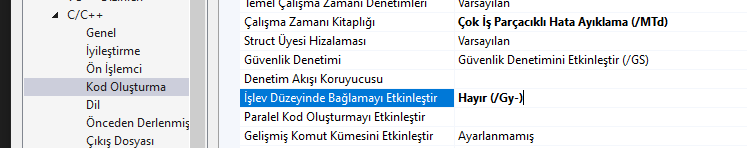

# Metin 2 Rehberi
Burada Metin 2 için 2014 yılında sızdırılan kaynak kodlarından temiz bir server client alt yapısı oluşturulmaya çalışılacak.Bununla beraber Metin2 kaynak koları hakkında bilgiler, derleme aşaması,server configurasyonu,oyunu çalıştırmak,Oyun içi ve oyun dışındaki server veya client tarafındanki hata çözümleri yer alacak.Burasının tüm Metin2 yapısı için kapsamlı notların ve bilgilerin yer aldığı bir sayfa olması hedefleniyor.

*Tarih : 2023.08.25*

## 1. FreeBsd 9.3 Server Kurulumu
Kaynak kodlar sızdırıldığında FreeBsd 9.3 bir işletim sistemi üzerinde çalıştığı için bu işletim sisteminin kurulumu ile başlayacağız.
Burada FreeBsd 9.3 kurulumunun anlatımı değilde Freebsd kurarken bazı ayrıntılara değinilecek.

İlk olarak makine oluşturuluyor makine Qemu/Kvm teknolojisi ile Virt Manager kullanılarak oluşturuldu.Ancak Oracle ın Virtual Box veya VMware de kullanılabilirdi.

**Makine Diskinin oluşturulması**
```bash
qemu-img create -f qcow2 freebsd_9-3_i386_4cpu-4096mem-60G-hdd.qcow2 60G  
```

**Sanal Makine** : 
Sanal makine qemu/kvm alt yapısında çalışıyor.Eğer aynı ayarlarda Bir sanal makine oluşturulmak istenirse [xml dosyası](./SanalMakine/Config/freebsd_9-3_i386_4cpu-4096mem-60G-hdd-conf.xmls) ile aynı makine oluşturulabilir.Oluşturulan makine içerisinde şifreler de *readme* dosyası içerisindedir.Şifreler ,xml içerisindeki disk ve iso dizini değiştirilebilir hepsi farklılık gösteren şeylerdir.Sanal makinanın configurasyonunun nasıl yedeklendiği ve nasıl oluşturulduğu ile ilgili bir [döküman](./Dokumanlar/QemuLibvirt-diskimage-vmconf.md)


**Makine kurulumu ve sonra yapılan configurasyonlar**
Makine kurulurken ssh ve dumpdev servislerinin aktif edilmesi gerekli eğer aktif edilmesse daha sonradanda aktif edilebilir.

Kurulum tamamlandıktan sonra `/etc/ssh/sshd.config` dosyasını `ee` editörü ile açıp düzenlemeler yapmammız lazım.
`ee /etc/ssh/sshd.config` şeklinde bir komut ile açabiliriz.
Dosyayı açtıktan sonra bu dosya içerisinde `#PasswordAuthentication no` yazan satırı bulup `PasswordAuthentication yes` olarak değiştiriyoruz. `#` işaretleri yorum satırı olduğunu gösterir ve o satırdakiler dikkate alınmaz.Aynı şekilde `#PermitRootLogin no` yazan satırı bulup `yes` olarak değiştiriyoruz.Bu şekilde dışarıdan root olarak ssh bağlantısı yapabileceğiz.

Bu ayarlamaları yaptıktan sonra `reboot` komutu ile makine yi yeniden başlatıyoruz bundan sonrada ssh ve ftp ile bağlanabiliriz ftp varsayılan olarak açık oluyor.

## 2. Server Paketlerinin kurulumu
FreeBsd 9.3 sürümünde `pkg` paket yöneticisinin desteği kalktığı için bu paket yöneticisini kendimiz kurmamız gerekli.Aşağıdaki komut portslar içerisinden `pkg` yi kurabiliriz.Bu komut `pkg` yi kaynak kodlarından derler ve `pkg` kurmamızın sebebi hazır derlenmiş olan paketleri kurabilmek.

```bash
cd /usr/ports/ports-mgmt/pkg/ && make -DBATCH install clean
```
kurulması gereken paketlerin  bulunduğu zip dosyası `./Paketler/Freebsd-9.3-temel-paketleri.zip`
Bu dosyanın içindekileri server içerisinde `/var/cache/pkg/` dizinine atıyoruz.Kurulumları buradan yapacağız.

## 3. Paketlerin Kurulumu
`pkg add <paket_adı>` komutuyla paketlerin kurulumunu yapıyoruz ancak paketlerin bağımlılıklarından dolayı aşağıdaki sırayla kurmak gerekli.

1. xproto-7.0.27-8f0c903ddd.txz
2. indexinfo-0.2.3-8e42ef8da1.txz
3. libedit-3.1.20150325_2,1-80bff3b261.txz
4. openssl-1.0.2_3-05319ee068.txz 
5. libffi-3.2.1-150efa3e3e.txz 
6. python27-2.7.9_1-8e3d7936d0.txz
7. python2-2_3-560d6468f5.txz
8. python-2.7_2,2-c3fe5f14d5.txz
9. gmake-4.1_2-fdd1e6002a.txz 
10. makedepend-1.0.5,1-4d00b3bcf3.txz 
11. perl5-5.24.1.r4_1-1ea84e082b.txz
12. mysql56-client-5.6.34-5f5369ef5b.txz
13. mysql56-server-5.6.34-8cc3d17934.txz

Temel Paketler hakkında kısa [açıklama](./Dokumanlar/TemelPaketler.md)

```console
root@metin2server:/var/cache/pkg # pkg info
gmake-4.1_2                    GNU version of 'make' utility
indexinfo-0.2.3                Utility to regenerate the GNU info page index
libedit-3.1.20150325_2,1       Command line editor library
libffi-3.2.1                   Foreign Function Interface
makedepend-1.0.5,1             Dependency generator for makefiles
mysql56-client-5.6.34          Multithreaded SQL database (client)
mysql56-server-5.6.34          Multithreaded SQL database (server)
openssl-1.0.2_3                SSL and crypto library
perl5-5.24.1.r4_1              Practical Extraction and Report Language
python-2.7_2,2                 The "meta-port" for the default version of Python interpreter
python2-2_3                    The "meta-port" for version 2 of the Python interpreter
python27-2.7.9_1               Interpreted object-oriented programming language
xproto-7.0.27                  X11 protocol headers
```
sadece googletest paketini kurmadık bunu ilerleyen kısımlarda kuracağız zatem şu anda lzma bağımlılığı var hemen kuramayız.

mysql dizini için dosya yekilerini ayarlayıyoruz.
```console
root@metin2server:~ # chown -R mysql:mysql /var/db/mysql
```
sunucu açıldığında otomatik olarak mysql servisinin çalışması için rc.conf dosyasına mysql servisini ekliyoruz.
```console
root@metin2server:~ # chown -R mysql:mysql /var/db/mysql
```
mysql servisini başlatıyoruz
```console
root@metin2server:~ # service mysql-server start
Starting mysql.
```
mysql için root şifresi belirliyoruz ilk kez mysql kurulmuşsa şifre boştur
```console
root@metin2server:~ # mysqladmin -u root -p password
Enter password: 
New password: 
Confirm new password: 
```
`mysql -u root -p` komutuyla mysql e bağlanıyoruz ve aşağıdaki yetkilendirmeleri yapıyoruz her ihtimale karşın CREATE USER denemesi yaptık ama zaten root kullanıcının var olduğunu biliyorduk.
```console
mysql> CREATE USER 'root'@'%' IDENTIFIED BY 'root';
ERROR 1396 (HY000): Operation CREATE USER failed for 'root'@'%'

mysql> GRANT ALL PRIVILEGES ON *.* TO 'root'@'%' WITH GRANT OPTION;
Query OK, 0 rows affected (0.00 sec)

mysql> flush privileges;
Query OK, 0 rows affected (0.00 sec)

mysql> quit
Bye

```

buradan sonra workbench yada navicat gibi uygulamalar ile mysql bağlantısı gerçekleştirilebilir.Bu yetkiler verilmesse dışarıdan bağlanılamaz.

## 4. Kaynak Kodlar
Kaynak kodlar 2014 yılına ait [ham kaynak kodlardır](./Paketler/kaynakkodlar/kraizy.zip)
Buradaki kodlar içerisinden şimdilik novaline ı üzerinde çalışacağız novaline da bazı bugların fixlendiğini ve bazı hataların zaten giderilmiş olduğunu biliyoruz.öncelikle çalışma yapabilmek için temizlik yapmamız gerekli bunun bu zip dosyasını ayıkladıktan sonra içerisinde sadece novaline dosyaları kalacak ve novaline içerisinde bulunan debug, release, obj gibi derleme sırasında ortaya çıkan dosyaları hem yer kaplamaması hemde kafa karaşıklığına neden olmaması için siliyoruz. 

kraizy.zip arşivini ayıkladıktan içerisindekilerden silininen dizinler
```console
/dev
/dev_wolf_branch
/mainline_cython
/mainline_released
/mainline_w2.0
/mainline_w2.1
/mainline

# tüm kalsörlerin içindeki Debug klasörleri silinecek. ve _UpgradeReport_Files ,ipch adlı klasörler silinecek 

/novaline/Srcs/Client/obj
/novaline/Srcs/Client/ipch
/novaline/Srcs/Client/Metin2Client_VC90.sdf

/novaline/Srcs/Server/db/Depend
/novaline/Srcs/Server/db/Depend.bak
/novaline/Srcs/Server/db/DB_BUILD_LOG.txt
/novaline/Srcs/Server/db/ERROR_LOG.txt

/novaline/Srcs/Server/game/locale
/novaline/Srcs/Server/game/data
/novaline/Srcs/Server/game/asdf
/novaline/Srcs/Server/game/CONFIG
/novaline/Srcs/Server/game/game.idb
/novaline/Srcs/Server/game/game.pdb
/novaline/Srcs/Server/game/game_r_32
/novaline/Srcs/Server/game/metin2@10.1.89.23
/novaline/Srcs/Server/game/sdf
/novaline/Srcs/Server/game/test
/novaline/Srcs/Server/game/VERSION.txt
/novaline/Srcs/Server/game/src/_UpgradeReport_Files
/novaline/Srcs/Server/game/src/OBJDIR

/novaline/Srcs/Tools/WorldEditor/WorldEditor_VC90.sdf
/novaline/Srcs/Tools/obj
/novaline/Srcs/Tools/WorldEditor/Debug
/novaline/Srcs/Tools/WorldEditor/ipch
/novaline/Srcs/Tools/_UpgradeReport_Files
```

bu temizliğin ardından novaline dosyasını tar formatında arşivliyoruz([novaline](./Paketler/TemizKaynakKod-novaline/novaline.tar)) hem elimizin altında bir temiz kaynak bulunsun hemde bunu serverde `/home` diznine arşiv olarak atıp orada tekrar ayıklayacağız direkt dosyaları atarsak bazen aktarımda dosya isimlerinden dolayı hata verebiliyor.


Server tarafına attığımız ham dosyalar aynı zamanda bir git alt yapısında tutulacak ve dosyaların üzerinde yapılan değişiklikler git ile izlenmesi sağlanacak.Git izlemi **novaline** ın gereksiz yer kaplayan dosyalardan arındırıldıktan sonraki hali git e dahil edildi.Burada takip edilecek Dosya bu dizindeki `Server` dizininin altında yer alıyor yani Server dosyasını oyun kaynak kodlarını derlediğimiz sunucu olarak düşünebiliriz.Oyun Dosyaları dışında yapılan değişikler örnek olarak pkg kurulumları ve sistem içerisinde kullanlan bazı kısımlar zaten bu anlatımda yer alacak sadece server klasörünü oyun dosyalarının toplu bir izlemesi olarak düşünebiliriz.

`/home` dizini oluşturduktan sonra içerisine sadece arşivi atıyoruz ve ayıklıyoruz daha sonra `/home/novaline/Srcs` içerisine giriş  `Server` dosyasının haricindekileri siliyoruz. `Extern` nin hepsini atmayacağız çünkü içerisinde çalışmayan eklentiler var bunların bazılarını kendimiz oluşturacağız.

## 5. Server Extern Dosyalarını Oluşturmak
- `/home/novaline/Srcs/Extern` dizinini oluşturuyoruz ve içerisine arşivimizde bulunun `/novaline/Srcs/Extern/` dizininde bulunan `cryptopp` dosyasını atıyoruz.
- Daha sonra aynı dizine `/home/novaline/Srcs/Extern/include`,`/home/novaline/Srcs/Extern/lib` adında iki klasör oluşturuyoruz.Arşivde bulunan `Extern/include/` içindeki `cryptopp`, `gtest`, `il` dosyalarını serverdaki `/home/novaline/Extern/include/` dizinine atıyoruz.
- Daha sonra [Boost](./Paketler/ServerFilesPaketleri/boost_1_43_0.tar.gz) arşivini `/home/novaline/Extern/include/` dizinine atıyoruz ve aynı dizine ayıklıyoruz. Ayıklanan dosyanın içerisindeki `boost` klasörünü bir dizin geriye `/home/novaline/Extern/include/` dizinine alıyoruz.
- Dada sonra `cp -r /usr/local/include/mysql` klasörünü `/home/novaline/Srcs/Extern/include/` içerisine aynı isimde ve içerisinkeki dosyalarla kopyalıyoruz.
- Daha sonra `/home/novaline/Srcs/Server/libdevil/` içerisindeki `.a` uzantılı static kütüphaneleri `/home/novaline/Srcs/lib/` içerisine atıyoruz.
- Dahra sonra `googletest-1.7.0.txz` paketi kurulmamıştı bu paketi arşiv yönetici ile açıp içerisinden `/usr/local/lib/libgtest.a` dosyasını alıp `/home/novaline/Extern/lib/` içerisine atıyoruz.

## 6. Server Kodlarının Build Edilmesi
Öncelikle `/home/novaline/Srcs/Extern/cryptopp/` dizininin içerisine gelip `gmake libcryptopp.a -j10` komutuyla cryptopp un derlenmesini sağlıyoruz ve `/home/novaline/Srcs/Extern/lib/libcryptopp.a` dosyası çıkartıldı.

server üzerinden [svn-version](./Dokumanlar/svn-version.md) paketi kurulu olmadığı için server klasörü derlenirken svn hatası verecektir bunun makefile üzerinden bir düzenleme yapıyoruz.

```makefile
# SVN_VERSION = $(shell svnversion -n .) 
SVN_VERSION = $(shell cat ../../__VERSION__)
P4_VERSION = $(shell cat ../../__VERSION__)
```
`Server/game/src/Makefile` da mevcut svn versiyonu nu alan kısmı # işareti yorum satırı yaptık ve versiyon bilgisini bizim oluşturduğumuz `__VERSION__` dosyasından almasını sağladık.

```makefile
# SVN_VERSION = $(shell svn info |grep Revision: |cut -c11-)
SVN_VERSION = $(shell cat ../../__VERSION__)
```

yukarıda yaptığımız aynı işlemi `Server/db/src/Makefile` içinde yaptık


Daha sonra `Server/Makefile` içerisinde yorum satırlarını kaldırdık ve clean komutu ekledik. **(commit id : cb51f99)**
```makefile

clean: .
	$(MAKE) -C libserverkey clean
	$(MAKE) -C liblua clean
	$(MAKE) -C libsql clean
	$(MAKE) -C libgame/src clean
	$(MAKE) -C libpoly clean
	$(MAKE) -C libthecore/src clean
	$(MAKE) -C game/src clean
	$(MAKE) -C db/src clean
```

Cryptopp hatalarını çözmek için  db ve game Makefile'larındaki CFLAG parametrelerine`-fno-strict-aliasing -pthread` parametrelerini eklemeliyiz **(commit id : f9d4791)**

### Game Build
şu anda derlemek için game veya db den başlanırsa bazı .o uzantılı dosyaların eksik olduğu hatası alırız önce `Server/` dizini içerisinde `gmake all -j4` komutuyla serverin derlerlenmesi gerek bu şekilde yapmamızın sebebi server derlenirken belirli bir sıraya göre derleniyor game veya db eksik dosya kalmıyor char hatasını bu şekilde çözülebilir.

eğer şu şekilde bir hata alınırsa
```console
linking ../test
/usr/bin/ld: cannot find -lserverkey
Makefile:143: recipe for target '../test' failed
gmake[1]: *** [../test] Error 1
gmake[1]: *** Waiting for unfinished jobs....
gmake[1]: Leaving directory '/home/novaline/Srcs/Server/game/src'
Makefile:76: recipe for target 'all' failed
gmake: *** [all] Error 2
```
`gmake -j5` komutu `Serverkey/libserverkey/`dizininde çalıştırılarak libserverkeyin derlenmesi sağlanır ve ardından tekrar `/game/src/` dizini derlenebilir. bu sorunun giderilmesi `Server/Makefile` içinde değişiklik yapıldı libserverkey all kuralı içerisine eklenerek `Server` dizini derlenirken onunda all komutuyla beraber derlenmesi sağlandı.

game build edilirken test dosyasının çıkartılmaması için `/Server/game/src/Makefile` içerisindek aşağıdaki satırlar silinebilir yada yorum satırı olarak işaretlenebilir böylece test dosyası çıkartılmaz.
` `
```makefile
# TESTOBJ = $(OBJDIR)/test.o
# TESTCPP = test.cpp
# TEST_TARGET = $(BINDIR)/test
# $(TEST_TARGET): $(TESTCPP) $(CPPOBJS) $(COBJS) $(TESTOBJ)
#	@echo linking $(TEST_TARGET)
#	@$(CC) $(CFLAGS) $(LIBDIR) $(COBJS) $(CPPOBJS) $(TESTOBJ) $(LIBS) -o ../test
```
### Db Build
`Server/db/` içerisini yani db yi derlerken bu şekilde bir hata alıyoruz 

```console
DBManager.cpp: In member function 'void CDBManager::SetLocale(const char*)':
DBManager.cpp:172: error: 'class CAsyncSQL' has no member named 'SetLocale'
DBManager.cpp:173: error: 'class CAsyncSQL' has no member named 'SetLocale'
DBManager.cpp:174: error: 'class CAsyncSQL' has no member named 'SetLocale'
Makefile:64: recipe for target '.obj/DBManager.o' failed
gmake: *** [.obj/DBManager.o] Error 1
```

bunun nedeni tam olarak `DBManager.cpp:172: error: 'class CAsyncSQL' has no member named 'SetLocale'` yani CAsyncSQL adlı bir library bulamıyor bunu `Server/db/DbManager.cpp` dosyasında ve `Server/db/DbManager.h` dosyasında `CAsyncSQL` yazan kısımları `CAsyncSQL2` olarak değiştirmemiz lazım.

Setlocale hataları için de aynı dosyas içinde CDBManager metodu içerisinde aşağıdaki şekilde değişiklik yapıyoruz.
```cpp
void CDBManager::SetLocale(const char * szLocale)
{
    const std::string stLocale(szLocale);
	sys_log(0, "SetLocale start");
	for (int n = 0; n < SQL_MAX_NUM; ++n)
	{
		m_mainSQL[n]->SetLocale(stLocale);
		m_directSQL[n]->SetLocale(stLocale);
		m_asyncSQL[n]->SetLocale(stLocale);
	}
	sys_log(0, "End setlocale %s", szLocale);
}
```
hatanın çözümümü **(commit id : 07d7e0c)**

**db build edildiğinde çıkartılan dosyanın ismi**
db oluşturulurken `linking ...`yazıyor oluşturulan dosyanın ismi yazmıyor bunun için  **linking** kısmında `$(TARGET)` eklemesi yapılarak oluşturulan dosyanın ismi yazdırılabilir bunun için `Server/db/src/Makefile` da aşağıdaki gibi bir değişiklik yapılabilir

```makefile
$(TARGET): $(OBJS)
	@echo linking $(TARGET)...
	@$(CC) $(CFLAGS) $(LIBDIR) $(OBJS) $(LIBS) -o $(TARGET)
	@touch version.cpp
```
hatanın çözümümü **(commit id : 1c82e22)**

**db çalıştırıldığında çıkartılan version dosyası**
db çalıştırıldığın çıkarttığı versiyon bilgisini düzenleyebiliriz. bunun için `Server/db/src/versiyon.cpp` dosyasındaki **WriteVersion** metodunda aşağıdaki şekilde düzenleme yapabiliriz.

```cpp
void WriteVersion()
{
#ifndef __WIN32__
	FILE* fp(fopen("VERSION.txt", "w"));

	if (NULL != fp)
	{
		fprintf(fp, "db svn revision: %s\n", __SVN_VERSION__);
		fprintf(fp, "%s@%s:%s\n", __USER__, __HOSTNAME__, __PWD__);
		fclose(fp);
	}
	else
	{
		fprintf(stderr, "cannot open VERSION.txt\n");
		exit(0);
	}
#endif
}
```
aynı şekilde bu kısım game kısmında da var aynı değişiklikler game kısmındada yapılabilir.

**(commit id : 4977eaf)**

**Kodları VisualStudio açtıktan sonra sln dosya isimleri değiştirilebilir ancak tüm visual studio dosya içeriklerindede değiştirilmesi gerektiğinden şu aşamada gerekli değil daha sonra değiştirilmeli**

## Server Filesin Oluşturulması
burada server files oluşturmak için çalışmalar yapılacak bunun gerekli data,locale ve proto [dosyaları](./Paketler/ServerFilesPaketleri/data-locale-proto_dosyalari.zip) Paketler içerisine eklendi.

Öncelikle server tarafından belirli dizinleri oluşturmamız gerekli
```console
mkdir /usr/game
mkdir /usr/game/cores
mkdir /usr/game/logs
mkdir /usr/game/share
mkdir /usr/game/share/bin
mkdir /usr/game/share/conf
mkdir /usr/game/share/lib
mkdir /usr/game/share/lib/mark
mkdir /usr/game/share/package
mkdir /usr/game/share/panama
touch /usr/game/share/conf/CMD
touch /usr/game/share/conf/VERSION
```

**cores :** içerisinde kanal,auth ve db dosyaları olacak dosyaları bulunacak
**logs :** log kayıtları yer alacak.
**share :** quest ler olacak.
**mark :** lonca resimleri yer alıyor.
**package** ve **panama**şifreleme metodu için gerekli anahtarlar yer alıyor.Ancak şu an için kullanılmıyor.
**share/bin/ :** içerisinde game ve db dosyaları bulunacak.
**share/conf/ :** kısmında ise protolar ve sabit dosyaları bulunacak 
**share/conf/CMD :** dosyasında gm lerin hangi komutları kullanabileceği tanımlanıyor.
**share/conf/VERSION :** novaline client versiyonu yer alacak.`home/novaline/srcs/Server/game/src/config.cpp` dosyasından alıyor burdan değişiklik yapılabilir.
```cpp
bool LoadClientVersion()
{
	FILE * fp = fopen("VERSION", "r");

	if (!fp)
		return false;

	char buf[256];
	fgets(buf, 256, fp);

	char * p = strchr(buf, '\n');
	if (p) *p = '\0';

	fprintf(stderr, "VERSION: \"%s\"\n", buf);

	g_stClientVersion = buf;
	fclose(fp);
	return true;
}
```

**kanal başına client sayısı için metod :** Bu metod içinde `share/conf/` dizninine `state_user_count` adında bir dosya oluşturuyoruz.
```cpp
void LoadStateUserCount()
{
	FILE * fp = fopen("state_user_count", "r");

	if (!fp)
		return;

	if (!LC_IsHongKong())
		fscanf(fp, " %d %d ", &g_iFullUserCount, &g_iBusyUserCount);

	fclose(fp);
}
```

**BANIP için metod :** Bu metod içinde `share/conf/` dizninine `BANIP` adında bir dosya oluşturuyoruz.
```cpp
	while (fgets(buf, 256, fp))
	{
		// diğer kodlar...

		TOKEN("auth_server")
			{
				char szIP[32];
				char szPort[32];

				two_arguments(value_string, szIP, sizeof(szIP), szPort, sizeof(szPort));

				if (!*szIP || (!*szPort && strcasecmp(szIP, "master")))
				{
					fprintf(stderr, "AUTH_SERVER: syntax error: <ip|master> <port>\n");
					exit(1);
				}

				g_bAuthServer = true;

				LoadBanIP("BANIP");

				if (!strcasecmp(szIP, "master"))
					fprintf(stdout, "AUTH_SERVER: I am the master\n");
				else
				{
					g_stAuthMasterIP = szIP;
					str_to_number(g_wAuthMasterPort, szPort);

					fprintf(stdout, "AUTH_SERVER: master %s %u\n", g_stAuthMasterIP.c_str(), g_wAuthMasterPort);
				}
				continue;
			}

		// diğer kodlar...
	}
```

**pack metodu :** Bu metod içinde `share/conf/` dizninine `CRC` adında bir dosya oluşturuyoruz.
```cpp

void LoadValidCRCList()
{
	s_set_dwProcessCRC.clear();
	s_set_dwFileCRC.clear();

	FILE * fp;
	char buf[256];

	if ((fp = fopen("CRC", "r")))
	{
		while (fgets(buf, 256, fp))
		{
			if (!*buf)
				continue;

			DWORD dwValidClientProcessCRC;
			DWORD dwValidClientFileCRC;

			sscanf(buf, " %u %u ", &dwValidClientProcessCRC, &dwValidClientFileCRC);

			s_set_dwProcessCRC.insert(dwValidClientProcessCRC);
			s_set_dwFileCRC.insert(dwValidClientFileCRC);

			fprintf(stderr, "CLIENT_CRC: %u %u\n", dwValidClientProcessCRC, dwValidClientFileCRC);
		}

		fclose(fp);
	}
}
```

bu dosyaları oluşturduktan sonra yukarıda bahsettiğim [zip dosyası](./Paketler/ServerFilesPaketleri/data-locale-proto_dosyalari.zip) içerisinden `locale` ve `data` dosyalarını `/usr/game/share/` dizinine atıyoruz,  `proto` dosyasının içerisindekileri `/usr/game/share/conf/` içerisine atalım.Proto dosyaları oyundaki item ve mob bilgilerinin tutulduğu dosyalardır.


**Log dosyalarının oluşturulması**
```console
mkdir /usr/game/logs/db
mkdir /usr/game/logs/db/log
touch /usr/game/logs/db/PTS
```
bunları `home/novaline/srcs/Server/libthecore/src/log.c` içindeki kodlara göre oluşturuyoruz

bu dosyalar oluşturulduktan sonra `/usr/game/logs/db` klasörünü içindekilerle beraber aynı dizine aşağıdaki şekilde `ch1`, `ch2`, `ch99`, `auth` şeklinde kopyalıyalıyoruz.

```console
root@metin2server:/usr/game/logs # cp -R db ch1 
root@metin2server:/usr/game/logs # cp -R db ch2
root@metin2server:/usr/game/logs # cp -R db ch99
root@metin2server:/usr/game/logs # cp -R db auth
```
**commit id : 413c211**
**game ve db derlenmiş iki dosyaların linklenmesi**
```
root@metin2server:/usr/game/share/bin # ln -s /home/novaline/Srcs/Server/game/game_r40020_32 game
root@metin2server:/usr/game/share/bin # ln -s /home/novaline/Srcs/Server/db/db_r40020 db
```

**cores dosyasının düzenlenmesi**
```console
root@metin2server:/usr/game/cores # mkdir db
root@metin2server:/usr/game/cores # cd db
root@metin2server:/usr/game/cores/db # ln -s ../../share/bin/db db
root@metin2server:/usr/game/cores/db # ln -s ../../share/conf/item_names.txt item_names.txt
root@metin2server:/usr/game/cores/db # ln -s ../../share/conf/mob_names.txt  mob_names.txt
root@metin2server:/usr/game/cores/db # ln -s ../../share/conf/item_proto.txt item_proto.txt
root@metin2server:/usr/game/cores/db # ln -s ../../share/conf/mob_proto.txt mob_proto.txt
root@metin2server:/usr/game/cores/db # ln -s ../../logs/db/log log
root@metin2server:/usr/game/cores/db # ln -s ../../logs/db/PTS PTS
```

Daha sonra `/home/novaline/src/server/Doc/config_sample/db` dizinin de örnek bir config dosyası (*conf.txt*) bulunmakta bu dosyayı `/usr/game/cores/db/` içerisine atmamız gerek bu dosyayı atmadan önce düzenlememiz gerekli

```console
root@metin2server:/usr/game/cores/db # cp /home/novaline/Srcs/Server/Doc/config_sample/db/conf.txt /usr/game/cores/db/
```

```conf
WELCOME_MSG = "DB Server has been started"

SQL_ACCOUNT = "localhost account     metin2 metin2pass 3306"
SQL_PLAYER = "localhost player metin2 metin2pass  3306"
SQL_COMMON = "localhost common metin2 metin2pass 3306"
SQL_HOTBACKUP = "localhost hotbackup metin2 metin2pass 3306"

TABLE_POSTFIX = " "

BIND_PORT               = 15900
DB_SLEEP_MSEC           = 10
CLIENT_HEART_FPS        = 10
HASH_PLAYER_LIFE_SEC    = 600
BACKUP_LIMIT_SEC        = 3600
PLAYER_ID_START = 100
PLAYER_DELETE_LEVEL_LIMIT = 70

ITEM_ID_RANGE = 2000000000 2100000000

LOCALE = "latin1"
```

**localhost** yazan db serverin connection için kullandığı ip adresi
**SQL_ACCOUNT**,**SQL_PLAYER**,**SQL_COMMON**,**SQL_HOTBACKUP** yazan kısımlar db rolleridir.
localhosttan sonraki parametreler db rolleri,db kullanıcısı,db kullanıcı şifresi, sql port bilgisidir.

`TABLE_POSTFIX = ""` ŞEKLİNDE YAZILIRSA **postfix table** hatası verir o yüzden tırnaklar arasına bir space boşluk bırakılmalıdır.`TABLE_POSTFIX = " "` şeklinde olmalıdır.

`LOCALE = "latin1"` yerel dil ve karakter parametresidir veritabanı ile uyumlu olmalıdır.

Ayrıca config içerisinde yorum satırı kullanılmamalıdır çünkü bazen yorum satırlarından dolayı hata verebiliyor.

**Server database ayarlaması**
server database ayarlaması yukarıdaki config dosyasına tanımladığımız kullanıcı için mysql server üzerine kullanıcı oluşturmamız gerekli
```console
root@metin2server:/usr/game/cores/db # mysql -p
Enter password: 
Welcome to the MySQL monitor.  Commands end with ; or \g.
Your MySQL connection id is 1
Server version: 5.6.34 Source distribution

Copyright (c) 2000, 2016, Oracle and/or its affiliates. All rights reserved.

Oracle is a registered trademark of Oracle Corporation and/or its
affiliates. Other names may be trademarks of their respective
owners.

Type 'help;' or '\h' for help. Type '\c' to clear the current input statement.

mysql> CREATE USER 'metin2'@'localhost' IDENTIFIED BY 'metin2pass';
Query OK, 0 rows affected (0.01 sec)

mysql> GRANT ALL PRIVILEGES ON *.* TO 'metin2'@'localhost' WITH GRANT OPTION;
Query OK, 0 rows affected (0.00 sec)

mysql> quit
Bye
root@metin2server:/usr/game/cores/db # 
```
bundan sonra database lerin oluşturulması gerekli ancak şu sevideye hazır bir database kullanacağız [serverdb.tar.gz](./Paketler/ServerFilesPaketleri/serverdb.tar.gz) adlı arşiv içerisindeki dosyaları `/var/db/` içerisine ayılıyoruz. bu arşivi `/var/db/` konumuna attıktan sonra `tar -zxf serverdb.tar.gz` komutuyla ayıklıyoruz.

ve db yi çalıştırdığımızda 
```console
root@metin2server:/usr/game/cores/db # ./db & sleep 5
[1] 1336
Real Server
Log OffAsyncSQL: connected to localhost (reconnect 1)
Success PLAYER
AsyncSQL: connected to localhost (reconnect 1)
AsyncSQL: connected to localhost (reconnect 1)
AsyncSQL: connected to localhost (reconnect 1)
Success ACCOUNT
AsyncSQL: connected to localhost (reconnect 1)
AsyncSQL: connected to localhost (reconnect 1)
Success COMMON
AsyncSQL: connected to localhost (reconnect 1)
AsyncSQL: connected to localhost (reconnect 1)
AsyncSQL: connected to localhost (reconnect 1)
[1]  + Segmentation fault            ./db (core dumped)
root@metin2server:/usr/game/cores/db # 
```

bu hataları çözmek için **gdb** ile hata ayıklama yapabiliriz yada bu kısma **syserr** **syslog.core** uzantılı hata logu için dosyalar oluşturuyor.

**syserr çıktısı**
```console
root@metin2server:/usr/game/cores/db # cat syserr
SYSERR: Aug 27 17:56:00 :: pid_init: 
Start of pid: 1336
```

**syslog çıktısı**
```console
root@metin2server:/usr/game/cores/db # cat syslog 
SYSERR: Aug 27 17:56:00 :: pid_init: 
Start of pid: 1336

Aug 27 17:56:00 :: LOCALE set to latin1
Aug 27 17:56:00 :: connecting to MySQL server (player)
Aug 27 17:56:00 :: CREATING DIRECT_SQL
Aug 27 17:56:00 :: AsyncSQL: locale latin1
Aug 27 17:56:00 :: CREATING MAIN_SQL
Aug 27 17:56:00 :: AsyncSQL: locale latin1
Aug 27 17:56:00 :: CREATING ASYNC_SQL
Aug 27 17:56:00 :: AsyncSQL: locale latin1
Aug 27 17:56:00 ::    OK
Aug 27 17:56:00 :: connecting to MySQL server (account)
Aug 27 17:56:00 :: CREATING DIRECT_SQL
Aug 27 17:56:00 :: AsyncSQL: locale latin1
Aug 27 17:56:00 :: CREATING MAIN_SQL
Aug 27 17:56:00 :: AsyncSQL: locale latin1
Aug 27 17:56:00 :: CREATING ASYNC_SQL
Aug 27 17:56:00 :: AsyncSQL: locale latin1
Aug 27 17:56:00 ::    OK
Aug 27 17:56:00 :: connecting to MySQL server (common)
Aug 27 17:56:00 :: CREATING DIRECT_SQL
Aug 27 17:56:00 :: AsyncSQL: locale latin1
Aug 27 17:56:00 :: CREATING MAIN_SQL
Aug 27 17:56:00 :: AsyncSQL: locale latin1
Aug 27 17:56:00 :: CREATING ASYNC_SQL
Aug 27 17:56:00 :: AsyncSQL: locale latin1
Aug 27 17:56:00 ::    OK
Aug 27 17:56:00 :: ClientManager initialization.. 
Aug 27 17:56:00 :: InitializeLocalization() - LoadLocaleTable(count:13)
Aug 27 17:56:00 :: locale[UNKNOWN_KEY(SKILL_POWER_BY_LEVEL_TYPE0)] = 0 5 6 8 10 12 14 16 18 20 22 24
Aug 27 17:56:00 :: locale[UNKNOWN_KEY(SKILL_POWER_BY_LEVEL_TYPE1)] = 0 5 6 8 10 12 14 16 18 20 22 24
Aug 27 17:56:00 :: locale[UNKNOWN_KEY(SKILL_POWER_BY_LEVEL_TYPE2)] = 0 5 6 8 10 12 14 16 18 20 22 24
Aug 27 17:56:00 :: locale[UNKNOWN_KEY(SKILL_POWER_BY_LEVEL_TYPE3)] = 0 5 6 8 10 12 14 16 18 20 22 24
Aug 27 17:56:00 :: locale[UNKNOWN_KEY(SKILL_POWER_BY_LEVEL_TYPE4)] = 0 5 6 8 10 12 14 16 18 20 22 24
Aug 27 17:56:00 :: locale[UNKNOWN_KEY(SKILL_POWER_BY_LEVEL_TYPE5)] = 0 5 6 8 10 12 14 16 18 20 22 24
Aug 27 17:56:00 :: locale[UNKNOWN_KEY(SKILL_POWER_BY_LEVEL_TYPE6)] = 0 5 6 8 10 12 14 16 18 20 22 24
Aug 27 17:56:00 :: locale[UNKNOWN_KEY(SKILL_POWER_BY_LEVEL_TYPE7)] = 0 5 6 8 10 12 14 16 18 20 22 24
Aug 27 17:56:00 :: locale[LOCALE] = turkey
Aug 27 17:56:00 :: Changed g_stLocale latin1 to euckr
Aug 27 17:56:00 :: before call SetLocale: latin5
Aug 27 17:56:00 :: SetLocale start
Aug 27 17:56:00 :: 	--mysql_set_character_set(latin5)
Aug 27 17:56:00 :: 	--mysql_set_character_set(latin5)
Aug 27 17:56:00 :: 	--mysql_set_character_set(latin5)
Aug 27 17:56:00 :: 	--mysql_set_character_set(latin5)
Aug 27 17:56:00 :: 	--mysql_set_character_set(latin5)
Aug 27 17:56:00 :: 	--mysql_set_character_set(latin5)
Aug 27 17:56:00 :: 	--mysql_set_character_set(latin5)
Aug 27 17:56:00 :: 	--mysql_set_character_set(latin5)
Aug 27 17:56:00 :: 	--mysql_set_character_set(latin5)
```

**gdb**
```console
root@metin2server:/usr/game/cores/db # gdb
GNU gdb 6.1.1 [FreeBSD]
Copyright 2004 Free Software Foundation, Inc.
GDB is free software, covered by the GNU General Public License, and you are
welcome to change it and/or distribute copies of it under certain conditions.
Type "show copying" to see the conditions.
There is absolutely no warranty for GDB.  Type "show warranty" for details.
This GDB was configured as "i386-marcel-freebsd".
(gdb) file db
Reading symbols from db...done.
(gdb) bt
No stack.
(gdb) core db
"/usr/game/cores/db/db" is not a core dump: File format not recognized
(gdb) core db_r40020.core 
warning: core file may not match specified executable file.
Core was generated by `db_r40020'.
Program terminated with signal 11, Segmentation fault.
Reading symbols from /lib/libz.so.6...done.
Loaded symbols for /lib/libz.so.6
Reading symbols from /usr/lib/libstdc++.so.6...done.
Loaded symbols for /usr/lib/libstdc++.so.6
Reading symbols from /lib/libm.so.5...done.
Loaded symbols for /lib/libm.so.5
Reading symbols from /lib/libgcc_s.so.1...done.
Loaded symbols for /lib/libgcc_s.so.1
Reading symbols from /lib/libthr.so.3...done.
Loaded symbols for /lib/libthr.so.3
Reading symbols from /lib/libc.so.7...done.
Loaded symbols for /lib/libc.so.7
Reading symbols from /usr/lib/libsupc++.so.1...done.
Loaded symbols for /usr/lib/libsupc++.so.1
Reading symbols from /libexec/ld-elf.so.1...done.
Loaded symbols for /libexec/ld-elf.so.1
#0  0x2819bf52 in std::string::assign () from /usr/lib/libstdc++.so.6
[New Thread 28405800 (LWP 100139/db_r40020)]
[New Thread 28405500 (LWP 100138/db_r40020)]
[New Thread 28405200 (LWP 100134/db_r40020)]
[New Thread 28404f00 (LWP 100133/db_r40020)]
[New Thread 28404c00 (LWP 100129/db_r40020)]
[New Thread 28404900 (LWP 100128/db_r40020)]
[New Thread 28404300 (LWP 100118/db_r40020)]
(gdb) 
```

Bt komutu ile hatalarım tümünü görebiliriz veya core dosyasını okutarak hata ayıklama yapabiliriz ama bunun çözümü  “novaline/srcs/Server/db/” içindeki DBManager.cpp ve main.cpp dosyasındadır. 
Main.cpp dosyasındaki hotbackup if bloğunu siliyoruz.**(commit id : 0f64ddf)**

**resist_claw hatasi:**

şeklinde bir syserr hatası verirse bunu resist_claw sütünundan kaynaklanıyordur muhtemelenplayer db sinden mob_proto tablosundan silmek gerekli.

**auth dosyasının oluşturulması**
```console
root@metin2server:~ # cd /usr/game/cores
root@metin2server:/usr/game/cores # mkdir auth
root@metin2server:/usr/game/cores # cd auth
root@metin2server:/usr/game/cores/auth # ln -s ../../share/bin/game auth
root@metin2server:/usr/game/cores/auth # ln -s ../../share/data data
root@metin2server:/usr/game/cores/auth # ln -s ../../share/locale locale
root@metin2server:/usr/game/cores/auth # ln -s ../../share/conf/CRC CRC
root@metin2server:/usr/game/cores/auth # ln -s ../../share/conf/VERSION VERSION
root@metin2server:/usr/game/cores/auth # ln -s ../../share/conf/BANIP BANIP
root@metin2server:/usr/game/cores/auth # ln -s ../../share/conf/CMD CMD 
root@metin2server:/usr/game/cores/auth # ln -s ../../share/conf/state_user_count state_user_count
root@metin2server:/usr/game/cores/auth # ln -s ../../logs/auth/log log
root@metin2server:/usr/game/cores/auth # ln -s ../../logs/auth/PTS PTS


```

**kanalların oluşturulması**
kanal dosyalarının *auth* dan farkı içerisinde *BANIP* ve *auth* dosyalarının olmaması bu dosyaları auth diznini kopyaladıktan sonra kanal dosyalarının içerisinden silebiliriz. Auth içerisindeki *VERSION* dosyası farklı clientler den erişimi kısıtlamak için kullanılıyor.

```console
root@metin2server:/usr/game/cores # cp -R auth ch1 
root@metin2server:/usr/game/cores # cp -R auth ch2
root@metin2server:/usr/game/cores # cp -R auth ch99
```
dosyaları kopyaladık içerisinden auth ve BANIP dosyalarını siliyoruz.
```console
root@metin2server:/usr/game/cores # rm ch1/auth ch1/BANIP ch2/auth ch2/BANIP ch99/auth ch99/BANIP 
```

**package** dosyası ortak kullanıldığı için auth,ch1,ch2,ch99 için linklendi
```console
root@metin2server:/usr/game/cores # cd auth/
root@metin2server:/usr/game/cores/auth # ln -s ../../share/package/ package
root@metin2server:/usr/game/cores/auth # cd ../ch1
root@metin2server:/usr/game/cores/ch1 # ln -s ../../share/package/ package
root@metin2server:/usr/game/cores/ch1 # cd ../ch2
root@metin2server:/usr/game/cores/ch2 # ln -s ../../share/package/ package
root@metin2server:/usr/game/cores/ch2 # cd ../ch99
root@metin2server:/usr/game/cores/ch99 # ln -s ../../share/package/ package
```
package nin yanın panama klasörü de bulunuyor ancak şu aşamada eklemiyoruz.

**auth config ayarlaması**
şimdi auth conf dosyası için ayarlamaları yapacağız `/home/novaline/Srcs/Server/doc/config_sample/auth` içerisinden config dosyasını `/usr/game/cores/auth` içerisine kopyalayıp düzenleyeceğiz.

auth.conf dosyasının içeriğini düzenledik.
```conf
HOSTNAME: auth
CHANNEL: 1
PORT: 11900
P2P_PORT: 12900
DB_PORT: 15900
DB_ADDR: 127.0.0.1
PASSES_PER_SEC: 25
SAVE_EVENT_SECOND_CYCLE: 180
PING_EVENT_SECOND_CYCLE: 180
AUTH_SERVER: master
PLAYER_SQL: 127.0.0.1 metin2 metin2pass account
COMMON_SQL: 127.0.0.1 metin2 metin2pass common
LOG_SQL: 127.0.0.1 metin2 metin2pass log
ADMINPAGE_IP1: 192.168.100.207
ADMINPAGE_PASSOWORD: admin
```
şeklinde düzenleme yaparak `CONFIG` isminde kopyalıyoruz.


auth ve db portlarının `/usr/game/cores/db/conf.txt` kısmından kullanıyor.client ile oyuna bağlanmak için bu portlara göre ayarlamalar yapmamız gerekiyor.

daha sonra admin page eklememiz lazım bu `/home/novaline/Srcs/Server/src/game/src/config.cpp` içerisinde tanımlanmış daha bir çok config ayarını bu dosya içerisinden bakarak ekleyebilir açıp kapatabiliriz.

```cpp
std::vector<std::string>	g_stAdminPageIP;
std::string	g_stAdminPagePassword = "SHOWMETHEMONEY";
```

ile tanımlanmış bir kısım var.bu ayar dosyaları config.cpp dosylarında tanımlanmış.

bu düzenlemeyi yaptıktan sonra limit ayarını düzenlememiz gerekli.

**limit time ayarlaması**
auth u çalıştırabilmek için limit ayarlaması yapmamız gerekli bunun için `/home/novaline/Srcs/Server/game/src/config.cpp` dosyasında değişiklik yapıyoruz.
```cpp
if (!strncmp(netip, "999.999", 7)) // ignore if address is starting with 192
		{
			strlcpy(g_szInternalIP, netip, sizeof(g_szInternalIP));
#ifndef __WIN32__
			fprintf(stderr, "INTERNAL_IP: %s interface %s\n", netip, ifap->ifa_name);
#else
			fprintf(stderr, "INTERNAL_IP: %s\n", netip);
#endif
		}
```

`strncmp(netip, "192.168", 7)` yazan kısmı `strncmp(netip, "999.999", 7)` olarak değiştirdik, `000.000` olarakta değiştirebilirdik.
yada komple bu if bloğu silinebilir.

daha sonra aynı dizined `limit_time.h` dosyasında 

```cpp
#ifndef __LIMIT_TIME__
#define __LIMIT_TIME__

//#define ENABLE_LIMIT_TIME
#define GLOBAL_LIMIT_TIME 1411454472UL // Tue Sep 23 08:41:12 2014
#define TIME_OVER_PONG_DOWN_RATE 	50000
#define TIME_OVER_LOGIN_DOWN_RATE 	10000
#endif
```

`#define ENABLE_LIMIT_TIME` satırını yorum satırı yaptık.
**(commit id : a0a6214)**
bu değişiklikten sonra game kısmını tekrar derliyoruz.

**auth çalıştırılması**

`/usr/game/cores/auth` dizinine girerek `./auth & sleep 5` komutuyla auth çalıştırabiliriz bunun çalışması içni db nin de çalışıyor olması lazım bunu kontrol etmek için `sockstat -4 -l` komutunu çalıştırdığımızda
```console
root@metin2server:/usr/game/cores/db # sockstat -4 -l
USER     COMMAND    PID   FD PROTO  LOCAL ADDRESS         FOREIGN ADDRESS      
root     db_r40020  1588  19 tcp4   *:15900               *:*
mysql    mysqld     1567  10 tcp4 6 *:3306                *:*
root     sendmail   670   4  tcp4   127.0.0.1:25          *:*
root     sshd       667   4  tcp4   *:22                  *:*
root     syslogd    453   7  udp4   *:514                 *:*
```
çıktısında `db_r40020` yi görmemiz gerekli

auth çalıştıktan sonra
```console

root@metin2server:/usr/game/cores/auth # sockstat -4 -l
USER     COMMAND    PID   FD PROTO  LOCAL ADDRESS         FOREIGN ADDRESS      
root     game_r4002 1603  12 tcp4   192.168.100.156:11900 *:*
root     game_r4002 1603  13 tcp4   192.168.100.156:12900 *:*
root     db_r40020  1588  19 tcp4   *:15900               *:*
mysql    mysqld     1567  10 tcp4 6 *:3306                *:*
root     sendmail   670   4  tcp4   127.0.0.1:25          *:*
root     sshd       667   4  tcp4   *:22                  *:*
root     syslogd    453   7  udp4   *:514                 *:*
```
netstat çıktısında belirlediğimiz portlarda çalışan `game_r4002` yi görmeliyiz

**questlerin derlenmesi**
`/usr/game/share/locale/turkey/quest/` içersine girip `sh make.sh` komutuyla make dosyasını çalıştırıyoruz eğer `permission denied` bu dosya için `chmod 777 qc` komutuyle gerekli izinleri veriyoruz. Bu derlemeyide quest dizininde bulunan `quest_list` e göre yapıyor burada questlerin listesi var.

**kanalların configurasyonu**
mark,log,pts,game dosyalarını chler içinde eklememiz gerekli

```console
root@metin2server:/usr/game/cores/ch1 # ln -s ../../share/lib/mark mark
root@metin2server:/usr/game/cores/ch1 # ln -s ../../logs/ch1/log log
root@metin2server:/usr/game/cores/ch1 # ln -s ../../logs/ch1/PTS PTS
root@metin2server:/usr/game/cores/ch1 # ln -s ../../share/bin/game ch1

```
Server içerisinde bulunan game kısmındaki config dosyasını eklememiz gerekli `/home/novaline/Srcs/Server/doc/config_sample/game/CONFIG` bu dosyayı alıp aşadağıdaki şekilde düzenliyoruz ve `/usr/game/cores/ch1` içine atıyoruz.

düzenlenmiş config dosyası;
```config
HOSTNAME: ch1
CHANNEL: 1
PORT: 13900
P2P_PORT: 14900
DB_PORT: 15900
DB_ADDR: 127.0.0.1
MAP_ALLOW: 1 3 21 23 25 41 43 45 61 62 63 64 65 66 67 68 208 216 217 351 352
MAP_ALLOW: 69 70 71 72 73 104 108 109 301 302 303 304
PASSES_PER_SEC: 25
SAVE_EVENT_SECOND_CYCLE: 180
PING_EVENT_SECOND_CYCLE: 180
PLAYER_SQL: locahost metin2 metin2pass player
COMMON_SQL: locahost metin2 metin2pass common
LOG_SQL: locahost metin2 metin2pass log
MALL_URL: www.metin2.co.kr
VIEW_RANGE: 10000
ADMINPAGE_IP: 192.168.100.207
ADMINPAGE_PASSWORD: admin
SPAM_BLOCK_MAX_LEVEL: 90
GOLD_DROP_LIMIT_TIME: 10
MAX_LEVEL: 99
```
`MALL_URL` : item shop marketin linkidir.

çalıştırdıktan sonra syserr kaydı;
```
root@metin2server:/usr/game/cores/ch1 # cat syserr
SYSERR: Aug 28 22:26:53 :: pid_init: 
Start of pid: 2033

SYSERR: Aug 28 22:26:53 :: ChildLoop: AsyncSQL: query failed: Table 'log.invalid_server_log' doesn't exist (query: INSERT INTO invalid_server_log(locale_type, log_date, ip, revision) VALUES(12, NOW(), '192.168.100.156', 40020) errno: 1146)
SYSERR: Aug 28 22:26:57 :: LoadSkillMotion: Motion: Skill exist but no motion data for index 0 mob 3596 skill 257
SYSERR: Aug 28 22:26:57 :: LoadSkillMotion: Motion: Skill exist but no motion data for index 1 mob 3596 skill 258
SYSERR: Aug 28 22:26:57 :: LoadMotion: cannot find accumulation data in file 'data/monster/horse_event1/03.msa'
SYSERR: Aug 28 22:26:57 :: LoadMotion: cannot find accumulation data in file 'data/monster/dog_god/run.msa'
SYSERR: Aug 28 22:26:57 :: LoadMotion: cannot find accumulation data in file 'data/monster/lion/run.msa'
SYSERR: Aug 28 22:26:57 :: LoadMotion: cannot find accumulation data in file 'data/monster/dog_god/run.msa'
SYSERR: Aug 28 22:26:57 :: LoadMotion: cannot find accumulation data in file 'data/monster/lion/run.msa'
SYSERR: Aug 28 22:26:57 :: LoadMotion: cannot find accumulation data in file 'data/monster/dog_god/run.msa'
SYSERR: Aug 28 22:26:57 :: LoadMotion: cannot find accumulation data in file 'data/monster/lion/run.msa'
SYSERR: Aug 28 22:26:57 :: LoadMotion: cannot find accumulation data in file 'data/monster/horse_event1/03.msa'

```
*bu hataların çözümü şu an için bilinmiyor araştırılacak.!!!*

bu hataların dışında `SetShoItems: not enough shop window` hatası alınırsa yanında pazar slotlarının fazla olan kısımlarını veritabanından silmek hatayı çözebilir.`shop_item` tablosundan bu değişiklik yapılabilir.


aynı şeyi ch2 içinde yapıyoruz soft linkleri ch2 ye göre oluşturduktan sonra config dosyasını aşağıdaki gibi düzenliyoruz tek farklı olan kısım `HOSTNAME,CHANNEL,PORT,P2P_PORT` lardır portları diğer chler ile çakışmaması için değiştirdik.
```config
HOSTNAME: ch2
CHANNEL: 2
PORT: 13920
P2P_PORT: 14920
DB_PORT: 15900
DB_ADDR: 127.0.0.1
MAP_ALLOW: 1 3 21 23 25 41 43 45 61 62 63 64 65 66 67 68 208 216 217 351 352
MAP_ALLOW: 69 70 71 72 73 104 108 109 301 302 303 304
PASSES_PER_SEC: 25
SAVE_EVENT_SECOND_CYCLE: 180
PING_EVENT_SECOND_CYCLE: 180
PLAYER_SQL: localhost metin2 metin2pass player
COMMON_SQL: localhost metin2 metin2pass common
LOG_SQL: localhost metin2 metin2pass log
MALL_URL: www.metin2.co.kr
VIEW_RANGE: 10000
ADMINPAGE_IP: 192.168.100.207
ADMINPAGE_PASSWORD: admin
SPAM_BLOCK_MAX_LEVEL: 90
GOLD_DROP_LIMIT_TIME: 10
MAX_LEVEL: 99
```
ve çalıştırıyoruz. 
`sockstat -4 -l` çıktısı

```console
root@metin2server:/usr/game/cores/ch2 # sockstat -4 -l
USER     COMMAND    PID   FD PROTO  LOCAL ADDRESS         FOREIGN ADDRESS      
root     game_r4002 2091  12 tcp4   192.168.100.156:13920 *:*
root     game_r4002 2091  13 tcp4   192.168.100.156:14920 *:*
root     game_r4002 2033  12 tcp4   192.168.100.156:13900 *:*
root     game_r4002 2033  13 tcp4   192.168.100.156:14900 *:*
root     game_r4002 1603  12 tcp4   192.168.100.156:11900 *:*
root     game_r4002 1603  13 tcp4   192.168.100.156:12900 *:*
root     db_r40020  1588  19 tcp4   *:15900               *:*
mysql    mysqld     1567  10 tcp4 6 *:3306                *:*
root     sendmail   670   4  tcp4   127.0.0.1:25          *:*
root     sshd       667   4  tcp4   *:22                  *:*
root     syslogd    453   7  udp4   *:514                 *:*
```

aynı şekilde ch99 içinde bu adımları takip edeceğiz ancak config kısmında kanal ismi portu ve ve ayrıca `MAP_ALLOW` kısmı farklılık gösteriyor.

```config
HOSTNAME: ch99
CHANNEL: 99
PORT: 13999
P2P_PORT: 14999
DB_PORT: 15900
DB_ADDR: 127.0.0.1
MAP_ALLOW: 81 113 212 103 105 110 111 114 118 119 120 121 122 123 124 125 126 127 128 181 182 183 190 191 192
PASSES_PER_SEC: 25
SAVE_EVENT_SECOND_CYCLE: 180
PING_EVENT_SECOND_CYCLE: 180
PLAYER_SQL: localhost metin2 metin2pass player
COMMON_SQL: localhost metin2 metin2pass common
LOG_SQL: localhost metin2 metin2pass log
MALL_URL: www.metin2.co.kr
VIEW_RANGE: 10000
ADMINPAGE_IP: 192.168.100.207
ADMINPAGE_PASSWORD: admin
SPAM_BLOCK_MAX_LEVEL: 90
GOLD_DROP_LIMIT_TIME: 10
MAX_LEVEL: 99
```
ve çalıştırıyoruz. 
`sockstat -4 -l` çıktısı
```console
root@metin2server:/usr/game/cores/ch99 # sockstat -4 -l
USER     COMMAND    PID   FD PROTO  LOCAL ADDRESS         FOREIGN ADDRESS      
root     game_r4002 2121  12 tcp4   192.168.100.156:13999 *:*
root     game_r4002 2121  13 tcp4   192.168.100.156:14999 *:*
root     game_r4002 2091  12 tcp4   192.168.100.156:13920 *:*
root     game_r4002 2091  13 tcp4   192.168.100.156:14920 *:*
root     game_r4002 2033  12 tcp4   192.168.100.156:13900 *:*
root     game_r4002 2033  13 tcp4   192.168.100.156:14900 *:*
root     game_r4002 1603  12 tcp4   192.168.100.156:11900 *:*
root     game_r4002 1603  13 tcp4   192.168.100.156:12900 *:*
root     db_r40020  1588  19 tcp4   *:15900               *:*
mysql    mysqld     1567  10 tcp4 6 *:3306                *:*
root     sendmail   670   4  tcp4   127.0.0.1:25          *:*
root     sshd       667   4  tcp4   *:22                  *:*
root     syslogd    453   7  udp4   *:514                 *:*

```

**panama'nın eklenmesi**
```console
root@metin2server:/usr/game/share # mkdir panama
root@metin2server:/usr/game/share # cd ../cores/auth/
root@metin2server:/usr/game/cores/auth # ln -s ../../share/panama/ panama
root@metin2server:/usr/game/cores/auth # cd ../ch1
root@metin2server:/usr/game/cores/ch1 # ln -s ../../share/panama/ panama
root@metin2server:/usr/game/cores/ch1 # cd ../ch2 
root@metin2server:/usr/game/cores/ch2 # ln -s ../../share/panama/ panama
root@metin2server:/usr/game/cores/ch2 # cd ../ch99
root@metin2server:/usr/game/cores/ch99 # ln -s ../../share/panama/ panama
root@metin2server:/usr/game/cores/ch99 # 
```

**NOT**
oyunu açarken önce db yi sonra auth sonra ch1 ch2 ch.. açmalıyız .kapatırken önce auth,ch ler ve sonra auth sonra db yi kapatlıyız db herzama kapatılırken en son olmalı ki çünkü item kaybı yaşanabilir.

şu aşamada ServerFiles ile ilgili yapmamız gerekenleri yaptık.**(commit id:9625e38)**

## Client Extern'lerin Ayarlanması
Bu kısım için visual studio ya c++ oyun geliştirici eklentileri kurulmuş olmalıdır.Oyun client versiyonu 2014 de sızdırıldığı için güncellememiz gerekecek bunun cyrptoo , boost , jpeg kütüphaneleri client içerisine kurulması gerekli bunun için bazı dosyaları indirmemiz gerekli

1. [cryptopp-8.2](https://www.cryptopp.com/#download) indirdik.
2. [boost-1.7.3](https://www.boost.org/users/download/) buradan boost indirilebilir ancak yeni sürümler olduğu için [sourceforge](https://sourceforge.net/projects/boost/files/boost/) dan eğitim serisi ile uyumlu ilerlemek için eski 1.73.0 versiyonu indirdik 
3. [devil-sdk-1.8.0](https://openil.sourceforge.net/download.php) bu dosyanın windows için olanını indirdik
4. [jpegsr9d.zip](https://ijg.org/files/)dosyasını indirdik

ClientSource diye bir klasör oluşturduk ve içerisne “Client” “Extern” adından iki dosya oluşturduk.Temiz kaynak dosyasının içerisisinden `novaline/client` içerisindeki dosyaları oluşturduğumuz `ClientSouce/Client` içine atıyoruz.

indirdiğimiz dosyaları arşivlerinden çıkarttıktan sonra `ClientSource/Extern` adında oluşturduğumuz klasörünün içerisine **cryptopp** ve **include** adında iki klasör oluşturduk ve `ClientSource/Extern/include` içerisine tekrar bir **cryptopp** adında klasör oluşturduk şimdi indirdiğimiz cryptopp dosyasının içindekileri `ClientSource/Extern/cyrptopp` içerisine atıyoruz ve buradaki dosyaların içerisinden `.h` uzantılı dosyaları  da `ClientSource/Extern/include/cryptopp` dosyasının içine kopyalıyoruz.Temiz Kaynak kod olarak ayırdığımız arşivin içerisinde de bulunan `novaline/Srcs/Extern/include/cryptopp` dizini içerisindeki `cryptoppLiblink.h` dosyasını `ClientSource/Extern/include/cryptopp` içine kopyalıyoruz bu dosya aynı zamanda bizim server dosyalarımızında içinde aynı yoldada bulunmakta.Bu dosya içerisinden cryptopp sürümünü düzeltiyoruz.

```c
#ifndef _CRYPTOPPLIBLINK_H_
#define _CRYPTOPPLIBLINK_H_

#ifdef _DLL
#ifndef CRYPTOPP_IMPORTS
#define CRYPTOPP_IMPORTS
#endif
#endif

#if defined(CRYPTOPP_IMPORTS)
#include "dll.h"
#else
	#ifdef _WIN32
		#ifdef _DEBUG
			#pragma comment( lib, "cryptlib-8.2.0MTd.lib" )
		#else
			#pragma comment( lib, "cryptlib-8.2.0MT.lib" )
		#endif
	#endif
#endif

#endif /* !_CRYPTOPPLIBLINK_H_ */
```
`cryptlib-5.6.1MTd.lib` ->`cryptlib-8.2.0MTd.lib`  ve `cryptlib-5.6.1MT.lib` ->`cryptlib-8.2.0MT.lib` kısımlarını şeklinde düzelttik.

Daha sonra `ClientSource/Extern/include/` içerisine indirdiğimiz devil arşivinin içerisinden çıkan **IL** klasörünü atıyoruz. `ClientSource/Extern/` dizinine **lib** adında bir klasör oluşturup, arşivin `/lib/x86/Release/` dizininin içinde **.lib** uzantılı olan dosyaları `ClientSource/Extern/lib` içerisine atıyoruz.

Şimdi `/novaline/Srcs/Client/Extern` içinden “lib” ve “include” içinden bazı dosyaları almamız gerekiyor bunları alıp kendi oluşturduğumuz `ClientSource/Extern/` içindeki lib ve include içine atacağız.

**lib içerisindeki gerekli dosyaların listesi**
```
d3d8.lib     
dxtrans.lib  
granny2.lib              
mmap.lib        
python27.lib           
strmiids.lib
d3dx8.lib  
dmoguids.lib  
glut32.lib   
granny_inspector2.lib    
mss32.lib       
SecureEngineSDK32.lib
ddraw.lib  
dxguid.lib    
glut.lib     
grn2gr2.lib            
il_wrap.lib  
python27_d.lib  
SpeedTreeRT.lib
```
**include içerisindeki gerekli dosyaların listesi**
```
amstream.h  
d3d8types.h  
d3drmdef.h  
d3dtypes.h     
d3dx8.h        
d3dx8mesh.h   
dxfile.h   
MSS.H             
SpeedTreeRT.h
d3d8caps.h  
d3dcaps.h    
d3drm.h     
d3dx8core.h    
d3dx8math.h    
d3dx8shape.h  
dxtrans.h  
qedit.h
d3d8.h      
d3d.h        
d3drmobj.h  
d3dx8effect.h  
d3dx8math.inl  
d3dx8tex.h    
granny.h   
rrCore2.8.49.0.h
```
`rrCore2.8.49.0.h` dosyası oyunun kaynak kodalrı içerisinde yok bunu ayrıca internetten bulduk.

daha sonra `novaline/Srcs/Client/scriptLib/Python-2.2/` içindeki `.h` dosyalarını `ClientSource/Extern/include/Python-2.7` adında bir dizin oluşturup içine atıyoruz.


bundan sonra `novaline/Srcs/Extern/lib/` içindeki **python27.lib** , **python27_d.lib** dosyalarını
`clientSource/Extern/lib` içerisine kopyalıyoruz (ancak zaten tıpa tıp aynıları daha önce kopyalamışız)

şimdi lzo yu build edeceğiz.[lzo-2.10](https://linuxfromscratch.org/blfs/view/svn/general/lzo.html)    burdan indirdik sonra bunu visual studio nun bir toolu olan  “developer command prompt” ile arşivi çıkarttıktan sonra aynı dizinde `\B\win32\vc.bat` komutuyla build ettik vc.bat olan yere direk olarak gitmememizin sebebi alt directorylere inmesinden dolayı dosya yollarını bulamıyor yani bizim konumuzu referans alıyor bunun içni dosyalar bulunamadığından derlenemiyor.


burada lzo2.lib adında bir dosya dosya oluşturuldu `lzo-1.10/lzo2.lib` bunu dosyayı alıp kendi kaynak kodlarımza eklememiz lazım bu dosya lzo build ettiğimiz ana dizinde burdan alıyoruz ve `ClientSource/Extern/lib` içerisine atıyoruz.Burdan sonra `ClientSource/Extern/include/lzo` dizini oluşturuyoruz ve `lzo-1.10/include/lzo/` klasöründeki dosyaları oluşturduğmuz dizin içerisine atıyoruz. 

`novaline/srcs/Extern/include/lzo-2.03/lzoLibLink.h` dosyasını > `ClientSource/Extern/include/lzo/` içerisine atıyoruz.

bu dosyayı açtıktan sonra 
`#pragma comment( lib, "lzo-2.03" _RUNTIME_LIBRARY ".lib" )` satırını `#pragma comment( lib,"lzo-2.10.lib" )` olarak değiştiriyoruz.

`ClientSource/Extern/include/python-2.7/pyconfig.h` dosyasında aşağıdaki satırları görüldüğü gibi yeni pyhon sürümü ile değiştiriyoruz.

`#pragma comment(lib,"python22_d.lib")` -> `#pragma comment(lib,"python27_d.lib")` ve

`#pragma comment(lib,"lib,"python22.lib"")` -> `#pragma comment(lib,"python27_d.lib")`

Paragma kısımlarını değiştirdik python27_d.lib debug , python27.lib release olarak bunları yükleyecek.

**libjpeg** build edeceğiz bu kütüphane oyun içerisinde screenshot almamızı sağlayan bir eklenti. indirdiğimiz jpeg-9d arşini çıkartıp dosyanın içerisine giriyoruz ve vs developer command prompt açıyoruz.


bu şekilde build edildi

şimdi bu dosyayı visual studio'ya proje olarak ekliyoruz.


şöyle bi hata aldık burada 2019 derleme araçlarını yüklememiz gerekiyor çünkü 2022 sürümünü kullanıyoruz.


tamam dedik ve derleme araçları 1.43 e yükseltildi

 Ve üzerine gelip özellikler diyoruz.


c/c++ kısmından kod oluşturma diyoruz ve çalışma zamanı kitaplığını mt olarak değiştiriyoruz 


şimdi statik olarak eklenecek.


Bu kısım bu şekilde olmalı


Buradan çözümü derle diyoruz 


tekrar çözümü derle dedik ve derleme tamamlandı


oluşan dosyamız bunun içerisinde win32 ve onun içinden jpeg.lib dosyamızı alacağız bu dosyayı `ClientSource/Extern/lib` içine atalım bu dosyanın adını **libjpeg-9dMT.lib** olarak değiştirelim.


aynı zamanda jpeg için header dosyalarınıda almamız gerekiyor bunun için `ClientSource/Extern/include/”` içine **libjpeg-9d** adında bir klasör oluşturalım ve libjpeg derlediğimiz  ana klasör içinde bulunan tüm `.h` uzantılı dosyaları oluşturduğmuz klasör içine atalım. Daha sonra linklemeler için novaline kaynak kodlarından `novaline/Srcs/Extern/include/libjpeg-6d` klasöründen **jpegLibLink.h** adındaki dosyayı da buraya alalım ve `ClientSource/Extern/include/libjpeg-9d/` dizinine atalım.


Daha sonra **jpegLibLink.h** dosyasının içini açıp verisyonunu düzeltelim `#define LIBJPEG_VERSION		"6b"` satırını `#define LIBJPEG_VERSION		"9d"` şeklinde düzeltelim

client debug modda build edebilmek visual studio üzerinde bazı ayarlamalar yapmalıyız
projenin üzerine sağ tıklayıp burdan


yapılandırma yöneticisini seçiyoruz.


Burdan çözüm yapılandırmasına gelip yeni yi seçiyrouz


şeklinde ayarlayıp tamam diyoruz.


Şimdi debug oluştu


daha sonra jpeg olan alt dosyaya sağ tıklıyoruz ve özellikler diyoruz


ve özellik menüsü çıkıyor


kod oluşturma kısımından mt yi mtd yani çok iş parçacıklı hata ayıklama olarak seçiyoruz.



Işlev düzeyinde bağlama kısmını hayır olarak seçiyoruz.


iyileştirme kısmından çerçeve işaretlerini atla yı hayır olarak seçiyoruz.


gelişmiş komut kümesini etkinleştir kısmından streamin sımd extensions 2 (/arch:SSE2) yi seçiyoruz.


ön işlemci  kısımından ön işlemci tanımları satırındaki ndebug u kaldırıyoruz.


daha sonra tekrar derliyoruz.


Ve libjpeg I debug modda derlemiş olduk.


Debug kısmı için oluşan jpeg.lib dosyasını alıyoruz ve adını **libjpeg-9dMTd.lib** olarak değiştirip 


`ClientSource/Extern/lib/` dizinine içine atıyoruz.release hemde debug modda build etmemizin sebebi bazı lzo veya jpeg hatalarından kurtulmak.

**cryptopp build edilmesi**
`ClientSource/Extern/cryptopp/cryptest.sln` yi visual studio ile açıyoruz.


release olarak win32 için build edilmesi gerekli


build  edildi.

şimdi de debug modda build ediyoruz.


debug modda da derlendi


resimde görülen `ClientSource/Extern/cryptopp/Win32/Output/Relase/` ve `ClientSource/Extern/cryptopp/Win32/Output/Debug/` dizinlerinden de lib uzantılı 2 dosyayı alıyoruz

İsimleri değiştirdik bu isimleride zaten `ClientSource/Extern/include/cryptopp/cryptoppLibLink.h` dosyasından aldık çünkü burada belirtmiştik.Ve bu dosyaları `ClientSource/Extern/lib/` içerisine atıyoruz


`ClientSource/Extern/include/IL/` klasöründeki `config.h.win` dosyasınn sonundaki win uzantısını siliyoruz dosya `.h` uzantılı olması lazım

**boost kurulumu**
indirdiğimiz `boost_173_0.tar.gz` arşivinin içerisinden boost klasörünü olduğu gibi `ClientSource/Extern/include/` içine atıyoruz

**Client Extern Dosyalarının oluşturulması commit id : 3d5dda3**

